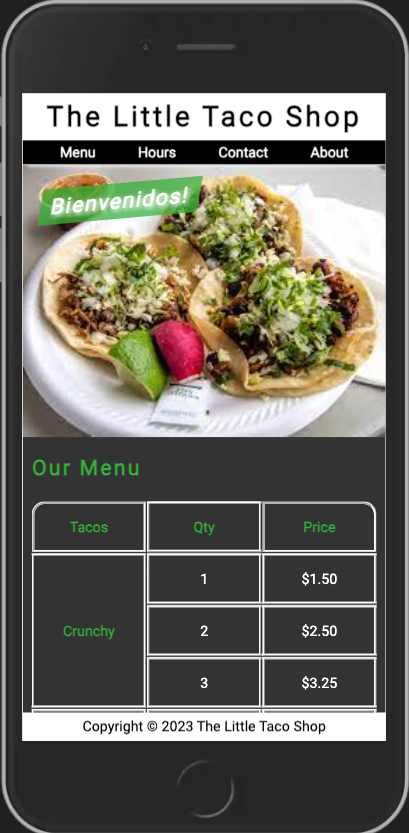

### Common media query breakpoints
---

Breakpoint  | Device/Viewport Size
---        | ---
320px | Small mobile phones (portrait)
480px | Small mobile phones (landscape)
768px | Tablets and large mobile phones
992px | Small desktop screens and laptops
1200px  | Desktop screens and large laptops
1440px  | Larger desktop screens and high-res displays

---

> css exercising

[ref css exercising: CSS Full Course for Beginners | Complete All-in-One Tutorial | 11 Hours](https://www.youtube.com/watch?v=n4R2E7O-Ngo)

